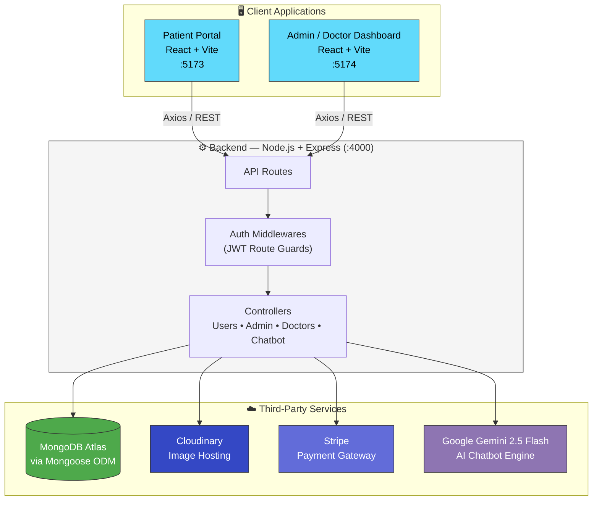
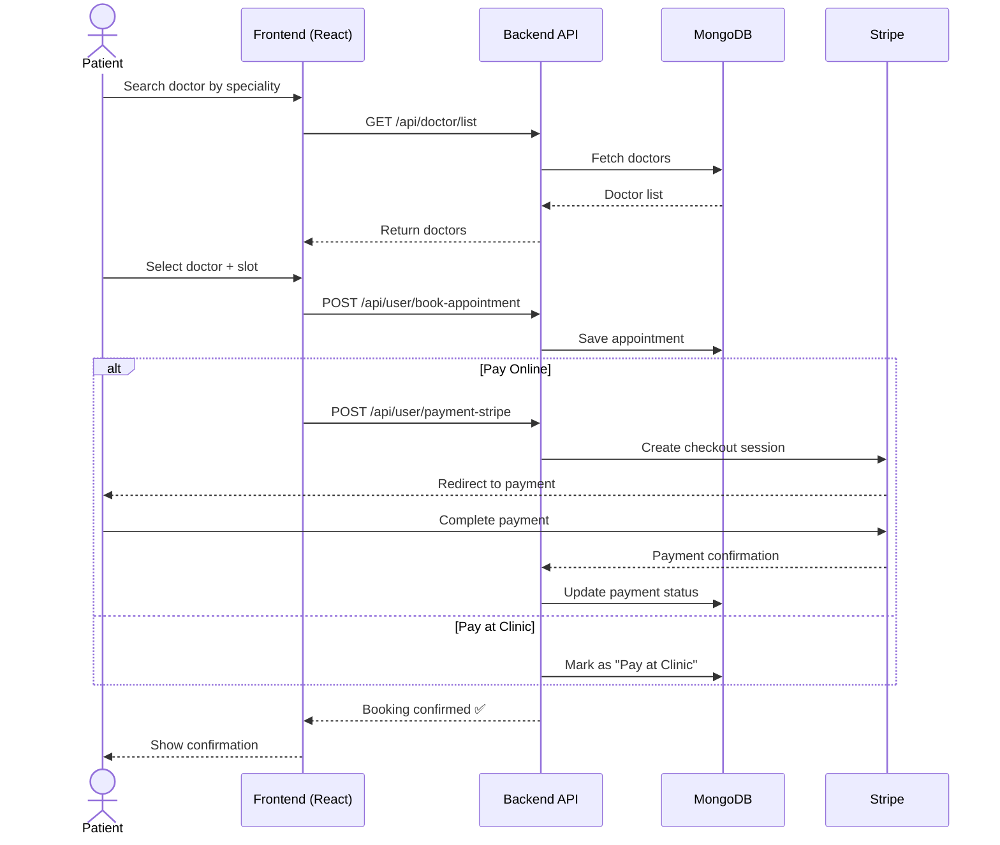
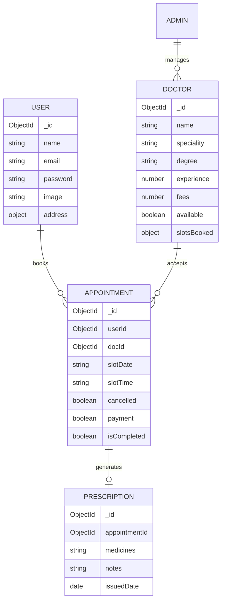
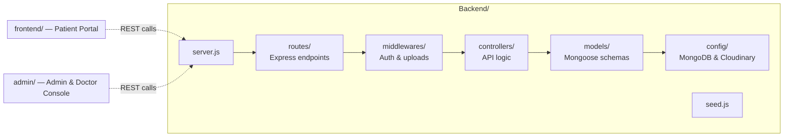

<div align="center">

# 🩺 Prescripto

### Doctor Booking & Healthcare Management System

*A modern, full-stack MERN platform for seamless doctor appointments, prescriptions, and clinic administration.*

[](https://www.mongodb.com/)
[](https://expressjs.com/)
[](https://react.dev/)
[](https://nodejs.org/)
[](https://vitejs.dev/)
[](https://tailwindcss.com/)
[](https://stripe.com/)
[](https://ai.google.dev/)

[Features](#-key-features) • [System Design](#-system-design) • [Tech Stack](#️-tech-stack) • [Setup](#-getting-started) • [Deployment](#-production-deployment)

</div>

---

## ✨ Overview

**Prescripto** connects patients, doctors, and clinic administrators in one unified platform. Patients can discover doctors, book appointments, pay online, chat with an AI health assistant, and access digital prescriptions — while doctors and admins manage the entire clinical workflow from dedicated dashboards.

|  |  |  |
| :---: | :---: | :---: |
| 👤 **Patient Portal** | 🩻 **Doctor Dashboard** | 🛠️ **Admin Console** |
| Book, pay, chat, track | Manage schedule & prescriptions | Oversee doctors, payments, analytics |

---

## 🚀 Key Features

### 👤 User / Patient Portal
- 🔐 Secure authentication with a global **Route Guard**
- 🔍 Search & filter doctors by speciality — *General Physician, Gynecologist, Dermatologist, Pediatrician, Neurologist, Gastroenterologist*
- 📅 Flexible appointment booking with real-time slot selection
- 💳 Dual payment modes — **Pay at Clinic (Cash)** or **Online via Stripe**
- 🤖 Interactive **AI Chatbot** powered by **Gemini 2.5 Flash** for symptom checks & recommendations
- 🧾 Downloadable/printable digital prescriptions

### 🛠️ Admin Dashboard
- 📊 Analytics at a glance — total doctors, appointments, patients, recent bookings
- 👨‍⚕️ Manage doctors — add, edit experience/bio, update availability, or remove
- 📋 View all appointments and update payment/cancellation status

### 🩻 Doctor Dashboard
- 🗓️ Manage scheduled appointments — mark completed or cancel
- 💊 Issue digital prescriptions directly on an appointment
- 💰 Monitor earnings and personal profile

---

## 🏗️ System Design

### High-Level Architecture



### Appointment Booking Flow



### Core Data Model



### Repository / Module Layout



---

## 🛠️ Tech Stack

| Layer | Technologies |
| --- | --- |
| **Frontend & Admin** | React.js (Vite) · Tailwind CSS · React Router DOM · Axios · React Toastify |
| **Backend** | Node.js · Express · MongoDB (Mongoose ODM) |
| **Media Hosting** | Cloudinary — doctor & user profile pictures |
| **Payments** | Stripe — secure online checkout with dynamic redirection |
| **AI** | Google Gemini 2.5 Flash — NLP-powered virtual health assistant |

---

## 📂 Project Structure

```text
├── Backend/                 # Express API server
│   ├── config/               # MongoDB & Cloudinary connectors
│   ├── controllers/          # API business logic (users, admin, doctors, chatbot)
│   ├── middlewares/          # Auth guards, file upload configs
│   ├── models/                # Mongoose schemas
│   ├── routes/                # Express API endpoints
│   ├── seed.js                # Database initial seeder script
│   └── server.js              # Entry point
├── frontend/                # Patient portal client
└── admin/                   # Admin & Doctor dashboard client
```

---

## ⚙️ Environment Variables Setup

### 1. Backend (`Backend/.env`)
```env
PORT=4000
MONGO_URI=your_mongodb_connection_string
CLOUDINARY_NAME=your_cloudinary_name
CLOUDINARY_API_KEY=your_cloudinary_api_key
CLOUDINARY_API_SECRET=your_cloudinary_api_secret
ADMIN_EMAIL=admin@prescripto.com
ADMIN_PASSWORD=your_admin_password
JWT_SECRET=your_jwt_secret_token
STRIPE_SECRET_KEY=your_stripe_secret_key
GEMINI_API_KEY=your_gemini_api_key
```

### 2. Patient Portal (`frontend/.env`)
```env
VITE_BACKEND_URL='http://localhost:4000'   # Change to production URL when live
```

### 3. Admin Portal (`admin/.env`)
```env
VITE_BACKEND_URL='http://localhost:4000'   # Change to production URL when live
```

---

## 🚀 Getting Started

### 1️⃣ Database Initialization (Seeding)
Pre-populate the database with **16 doctor profiles** and Cloudinary-hosted images:
```bash
cd Backend
npm install
node seed.js
```

### 2️⃣ Run the Backend
```bash
npm run server
```
> Runs at `http://localhost:4000` using `nodemon` (auto-reloads on file changes).

### 3️⃣ Run the Frontend (Patient Portal)
```bash
cd ../frontend
npm install
npm run dev
```
> Runs at `http://localhost:5173`.

### 4️⃣ Run the Admin / Doctor Console
```bash
cd ../admin
npm install
npm run dev
```
> Runs at `http://localhost:5174` (or next available port).

---

## 🌐 Production Deployment

### Backend
1. Deploy to **Render**, **Railway**, or **AWS**.
2. Add all environment variables from `Backend/.env` to the platform's environment settings.
3. Whitelist relevant IP addresses if your MongoDB cluster restricts access.

### Frontend & Admin
1. Deploy both as separate static sites on **Vercel** or **Netlify**.
2. Set the root directory to `frontend` and `admin` respectively.
3. Build command: `npm run build` · Output directory: `dist`.
4. Set `VITE_BACKEND_URL` to your live backend URL (e.g. `https://your-api.onrender.com`).

---

<div align="center">

Made with ❤️ using the MERN stack

</div>
